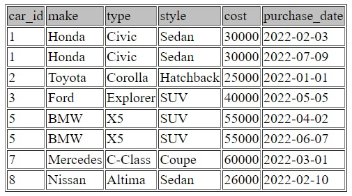
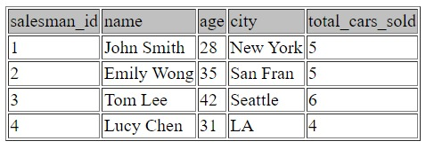
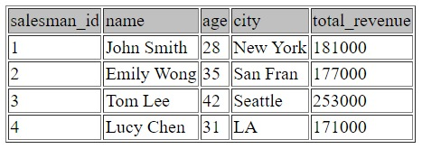
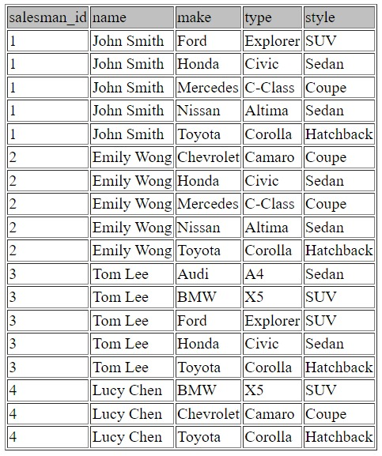
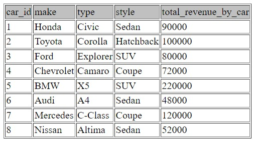
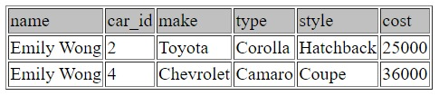
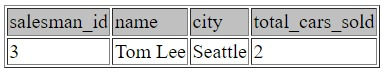
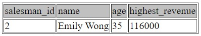

In this SQL project, we delve into the fascinating world of data analysis, a crucial tool for informed decision-making. By transforming the raw data retrieved from Steve's Car Showroom into valuable insights, we will drive his business towards success. Let's go!

## **Problem Statement**

Steve runs a top-end car showroom, but his data analyst has just quit and left him without his crucial insights. Can you analyze the following data to provide him with all the answers he requires?

## **Tables**

Here are the tables you will be using:


### **Schema SQL**

```sql
CREATE TABLE cars (
car_id INT PRIMARY KEY,
make VARCHAR(50),
type VARCHAR(50),
style VARCHAR(50),
cost INT
);
--------------------
INSERT INTO cars (car_id, make, type, style, cost)
VALUES (1, 'Honda', 'Civic', 'Sedan', 30000),
(2, 'Toyota', 'Corolla', 'Hatchback', 25000),
(3, 'Ford', 'Explorer', 'SUV', 40000),
(4, 'Chevrolet', 'Camaro', 'Coupe', 36000),
(5, 'BMW', 'X5', 'SUV', 55000),
(6, 'Audi', 'A4', 'Sedan', 48000),
(7, 'Mercedes', 'C-Class', 'Coupe', 60000),
(8, 'Nissan', 'Altima', 'Sedan', 26000);
--------------------

CREATE TABLE salespersons (
salesman_id INT PRIMARY KEY,
name VARCHAR(50),
age INT,
city VARCHAR(50)
);
--------------------
INSERT INTO salespersons (salesman_id, name, age, city)
VALUES (1, 'John Smith', 28, 'New York'),
(2, 'Emily Wong', 35, 'San Fran'),
(3, 'Tom Lee', 42, 'Seattle'),
(4, 'Lucy Chen', 31, 'LA');
--------------------

CREATE TABLE sales (
sale_id INT PRIMARY KEY,
car_id INT,
salesman_id INT,
purchase_date DATE,
FOREIGN KEY (car_id) REFERENCES cars(car_id),
FOREIGN KEY (salesman_id) REFERENCES salespersons(salesman_id)
);
--------------------
INSERT INTO sales (sale_id, car_id, salesman_id, purchase_date)
VALUES (1, 1, 1, '2021-01-01'),
(2, 3, 3, '2021-02-03'),
(3, 2, 2, '2021-02-10'),
(4, 5, 4, '2021-03-01'),
(5, 8, 1, '2021-04-02'),
(6, 2, 1, '2021-05-05'),
(7, 4, 2, '2021-06-07'),
(8, 5, 3, '2021-07-09'),
(9, 2, 4, '2022-01-01'),
(10, 1, 3, '2022-02-03'),
(11, 8, 2, '2022-02-10'),
(12, 7, 2, '2022-03-01'),
(13, 5, 3, '2022-04-02'),
(14, 3, 1, '2022-05-05'),
(15, 5, 4, '2022-06-07'),
(16, 1, 2, '2022-07-09'),
(17, 2, 3, '2023-01-01'),
(18, 6, 3, '2023-02-03'),
(19, 7, 1, '2023-02-10'),
(20, 4, 4, '2023-03-01');
```

### **Entity Relationship Diagram**

<iframe width="750" height="400" src='https://dbdiagram.io/e/65429a3c7d8bbd64654c2b89/65429e4a7d8bbd64654c6340'> </iframe>

## **Questions**

Click [here](https://www.db-fiddle.com/f/2rM8RAnq7h5LLDTzZiRWcd/5801) to follow along and answer the questions: 

1. **What are the details of all cars purchased in the year 2022?**

   ```sql
   SELECT 
       cars.car_id,
       cars.make,
       cars.type,
       cars.style,
       cars.cost,
       sales.purchase_date
   FROM cars
   JOIN sales ON cars.car_id = sales.car_id
   WHERE YEAR(purchase_date) = 2022;
   ```

   
2. **What is the total number of cars sold by each salesperson?**

   ```sql
   SELECT 
       salespersons.salesman_id,
       salespersons.name,
       salespersons.age,
       salespersons.city,
       COUNT(sales.sale_id) AS total_cars_sold
   FROM salespersons
   JOIN sales ON salespersons.salesman_id = sales.salesman_id
   GROUP BY salespersons.salesman_id;
   ```

   
3. **What is the total revenue generated by each salesperson?**

   ```sql
   SELECT 
       salespersons.salesman_id,
       salespersons.name,
       salespersons.age,
       salespersons.city,
       SUM(cars.cost) AS total_revenue
   FROM salespersons
   JOIN sales ON salespersons.salesman_id = sales.salesman_id
   JOIN cars ON sales.car_id = cars.car_id
   GROUP BY salespersons.salesman_id;
   ```

   
4. **What are the details of the cars sold by each salesperson?**

   ```sql
   SELECT DISTINCT
       sales.salesman_id,
       salespersons.name,
       cars.make,
       cars.type,
       cars.style
   FROM cars
   JOIN sales ON sales.car_id = cars.car_id
   JOIN salespersons ON salespersons.salesman_id = sales.salesman_id
   GROUP BY sales.sale_id;
   ```

   
5. **What is the total revenue generated by each car type?**

   ```sql
   SELECT 
       cars.car_id,
       cars.make,
       cars.type,
       cars.style,
       SUM(cars.cost) AS total_revenue_by_car
   FROM cars
   JOIN sales ON sales.car_id = cars.car_id
   GROUP BY cars.car_id;
   ```

   
6. **What are the details of the cars sold in the year 2021 by salesperson 'Emily Wong'?**

   ```sql
   SELECT 
       salespersons.name,
       cars.car_id,
       cars.make,
       cars.type,
       cars.style,
       cars.cost
   FROM cars
   JOIN sales ON sales.car_id = cars.car_id
   JOIN salespersons ON salespersons.salesman_id = sales.salesman_id
   WHERE YEAR(sales.purchase_date) = 2021 AND salespersons.name = 'Emily Wong';
   ```

   
7. **What is the total revenue generated by the sales of hatchback cars?**

   ```sql
   SELECT 
       cars.style, 
       SUM(cars.cost) AS hatchback_total_revenue
   FROM cars
   JOIN sales ON sales.car_id = cars.car_id
   WHERE cars.style = 'Hatchback'
   GROUP BY cars.car_id;
   ```

   
8. **What is the total revenue generated by the sales of SUV cars in the year 2022?**

   ```sql
   SELECT 
       cars.style, 
       SUM(cars.cost) AS SUV_total_revenue_2022
   FROM cars
   JOIN sales ON sales.car_id = cars.car_id
   WHERE cars.style = 'SUV' AND YEAR(purchase_date) = 2022;
   ```

   
9. **What is the name and city of the salesperson who sold the most number of cars in the year 2023?**

   ```sql
   SELECT 
       salespersons.salesman_id,
       salespersons.name,
       salespersons.city,
       COUNT(sales.sale_id) AS total_cars_sold
   FROM salespersons
   JOIN sales ON salespersons.salesman_id = sales.salesman_id
   WHERE YEAR(sales.purchase_date) = 2023
   GROUP BY salespersons.salesman_id
   ORDER BY total_cars_sold DESC
   LIMIT 1;
   ```

   
10. **What is the name and age of the salesperson who generated the highest revenue in the year 2022?**

    ```sql
    SELECT 
        salespersons.salesman_id,
        salespersons.name,
        salespersons.age,
        SUM(cars.cost) AS highest_revenue
    FROM salespersons
    JOIN sales ON salespersons.salesman_id = sales.salesman_id
    JOIN cars ON cars.car_id = sales.car_id
    WHERE YEAR(sales.purchase_date) = 2022
    GROUP BY salespersons.salesman_id
    ORDER BY highest_revenue DESC
    LIMIT 1;
    ```

    

## **Conclusion**

This SQL project offers valuable insights into the world of data analysis, showcasing its significance as a vital tool for informed decision-making. Steve's Car Showroom project informs us about cars purchased, salesperson performance, and revenue generation throughout the years. This is achieved by identifying popular cars, evaluating the sales team, and acknowledging high-earning salespeople. These insights are key to driving Steve's Car Showroom towards success and prosperity by enabling data-driven decision-making and optimizing business operations.

Adopted form [Steel Data](https://www.steeldata.org.uk/sql1.html).