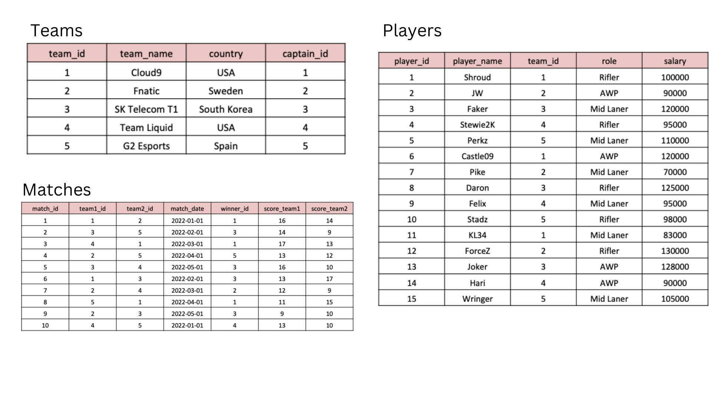
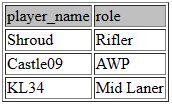

Dive into the electrifying world of eSports, where elite competitors from around the globe have converged for an intense showdown. As the excitement unfolds in this epic tournament, our mission is to dissect the provided data and unveil the comprehensive insights that encapsulate the essence of this thrilling gaming spectacle. Let the analysis commence!

## **Problem Statement**

The top eSports competitors from across the globe have gathered to battle it out. Can you analyse the following data to find out all about the tournament?

## **Tables**

Here are the tables you will be using:



### **Schema SQL**

```sql
CREATE TABLE teams (
    team_id INT PRIMARY KEY,
    team_name VARCHAR(50) NOT NULL,
    country VARCHAR(50),
    captain_id INT
);
--------------------
INSERT INTO teams (team_id, team_name, country, captain_id)
VALUES (1, 'Cloud9', 'USA', 1),
(2, 'Fnatic', 'Sweden', 2),
(3, 'SK Telecom T1', 'South Korea', 3),
(4, 'Team Liquid', 'USA', 4),
(5, 'G2 Esports', 'Spain', 5);
--------------------
CREATE TABLE players (
player_id INT PRIMARY KEY,
player_name VARCHAR(50) NOT NULL,
team_id INT,
role VARCHAR(50),
salary INT,
FOREIGN KEY (team_id) REFERENCES teams(team_id)
);
--------------------
INSERT INTO players (player_id, player_name, team_id, role, salary)
VALUES (1, 'Shroud', 1, 'Rifler', 100000),
(2, 'JW', 2, 'AWP', 90000),
(3, 'Faker', 3, 'Mid laner', 120000),
(4, 'Stewie2k', 4, 'Rifler', 95000),
(5, 'Perkz', 5, 'Mid laner', 110000),
(6, 'Castle09', 1, 'AWP', 120000),
(7, 'Pike', 2, 'Mid Laner', 70000),
(8, 'Daron', 3, 'Rifler', 125000),
(9, 'Felix', 4, 'Mid Laner', 95000),
(10, 'Stadz', 5, 'Rifler', 98000),
(11, 'KL34', 1, 'Mid Laner', 83000),
(12, 'ForceZ', 2, 'Rifler', 130000),
(13, 'Joker', 3, 'AWP', 128000),
(14, 'Hari', 4, 'AWP', 90000),
(15, 'Wringer', 5, 'Mid laner', 105000);
--------------------
CREATE TABLE matches (
match_id INT PRIMARY KEY,
team1_id INT,
team2_id INT,
match_date DATE,
winner_id INT,
score_team1 INT,
score_team2 INT,
FOREIGN KEY (team1_id) REFERENCES teams(team_id),
FOREIGN KEY (team2_id) REFERENCES teams(team_id),
FOREIGN KEY (winner_id) REFERENCES teams(team_id)
);
--------------------
INSERT INTO matches (match_id, team1_id, team2_id, match_date, winner_id, score_team1, score_team2)
VALUES (1, 1, 2, '2022-01-01', 1, 16, 14),
(2, 3, 5, '2022-02-01', 3, 14, 9),
(3, 4, 1, '2022-03-01', 1, 17, 13),
(4, 2, 5, '2022-04-01', 5, 13, 12),
(5, 3, 4, '2022-05-01', 3, 16, 10),
(6, 1, 3, '2022-02-01', 3, 13, 17),
(7, 2, 4, '2022-03-01', 2, 12, 9),
(8, 5, 1, '2022-04-01', 1, 11, 15),
(9, 2, 3, '2022-05-01', 3, 9, 10),
(10, 4, 5, '2022-01-01', 4, 13, 10);
```

### **Entity Relationship Diagram**

<iframe width="750" height="400" src='https://dbdiagram.io/e/6585603889dea62799684556/6585608a89dea62799684b1c'> </iframe>

## **Questions**

Click [here](https://www.db-fiddle.com/f/2rM8RAnq7h5LLDTzZiRWcd/6063) to follow along and answer the questions: 

1. **What are the names of the players whose salary is greater than 100,000?**

   ```sql
   SELECT p.player_name, p.salary
   FROM players AS p
   WHERE p.salary > 100000;
   ```

   
2. **What is the team name of the player with player_id = 3?**

   ```sql
   SELECT p.player_id, t.team_name
   FROM teams AS t
   JOIN players AS p ON t.team_id = p.team_id
   WHERE p.player_id = 3;
   ```

   
3. **What is the total number of players in each team?**

   ```sql
   SELECT t.team_id, t.team_name, COUNT(p.player_name) AS total_players
   FROM teams AS t
   JOIN players AS p ON t.team_id = p.team_id
   GROUP BY t.team_id;
   ```

   
4. **What is the team name and captain name of the team with team_id = 2?**

   ```sql
   SELECT t.team_id, t.team_name, p.player_name AS captain_name
   FROM teams AS t
   JOIN players AS p ON t.team_id = p.team_id
   WHERE p.team_id = 2
   ORDER BY p.salary DESC
   LIMIT 1;
   ```

   
5. **What are the player names and their roles in the team with team_id = 1?**

   ```sql
   SELECT player_name, role
   FROM players
   WHERE team_id = 1;
   ```

   
6. **What are the team names and the number of matches they have won?**

   ```sql
   SELECT t.team_name, COUNT(m.winner_id) AS matches_won
   FROM teams AS t
   JOIN matches AS m ON t.team_id = m.winner_id
   GROUP BY m.winner_id;
   ```

   
7. **What is the average salary of players in the teams with country 'USA'?**

   ```sql
   SELECT t.country, ROUND(AVG(p.salary)) AS players_avg_salary
   FROM players AS p
   JOIN teams AS t ON p.team_id = t.team_id
   WHERE t.country = 'USA';
   ```

   
8. **Which team won the most matches?**

   ```sql
   SELECT t.team_name, COUNT(m.winner_id) AS matches_won
   FROM teams AS t
   JOIN matches AS m ON t.team_id = m.winner_id
   GROUP BY m.winner_id
   ORDER BY matches_won DESC
   LIMIT 1;
   ```

   
9. **What are the team names and the number of players in each team whose salary is greater than 100,000?**

   ```sql
   SELECT 
     t.team_id, 
     t.team_name, 
     COUNT(p.player_name) AS total_players, 
     SUM(p.salary) AS sum_salary
   FROM players AS p
   JOIN teams AS t ON p.team_id = t.team_id
   WHERE p.salary > 100000
   GROUP BY t.team_id;
   ```

   
10. **What is the date and the score of the match with match_id = 3?**

    ```sql
    SELECT match_date, score_team1, score_team2
    FROM matches
    WHERE match_id = 3;
    ```

    

## **Conclusion**

As the curtain falls on this epic tournament, the SQL queries provided a window into the dynamics of the competition, answering crucial questions such as the names of players with salaries exceeding $100,000, team details for specific players, overall team statistics, and the outcomes of pivotal matches. This voyage of data analysis has not only illuminated the intricacies of the tournament but has also set the stage for informed decisions and a deeper understanding of the eSports landscape. Let the analysis stand as a testament to the power of data in uncovering the narratives within the realm of competitive gaming.

Adopted form [Steel Data](https://www.steeldata.org.uk/sql2.html).